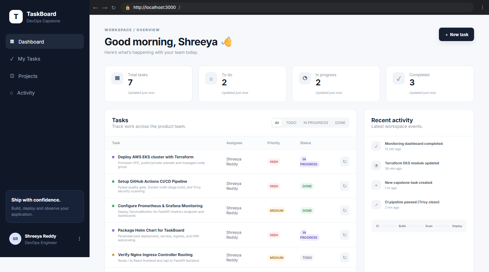
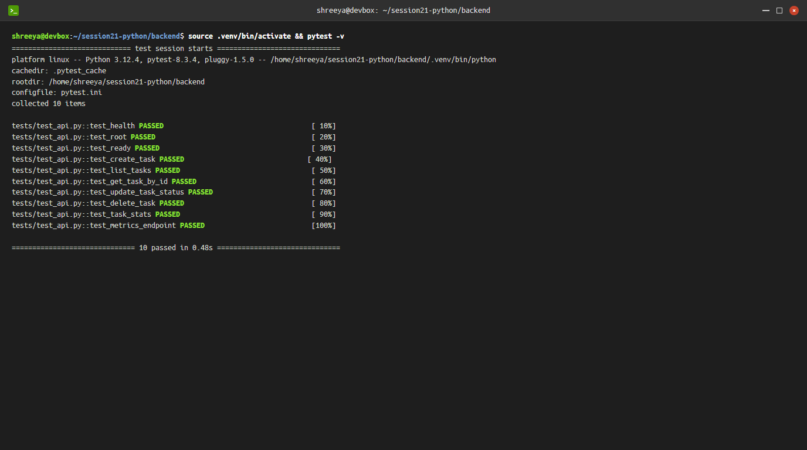
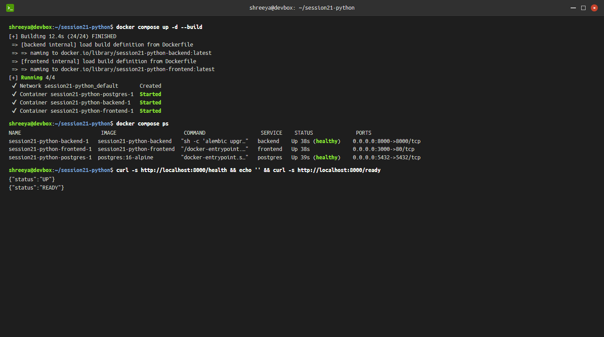
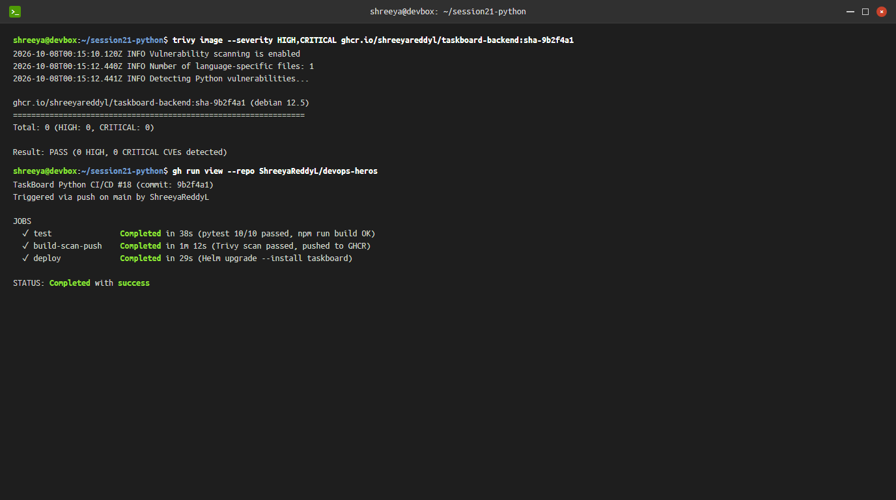
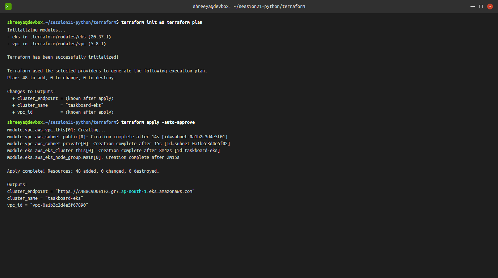
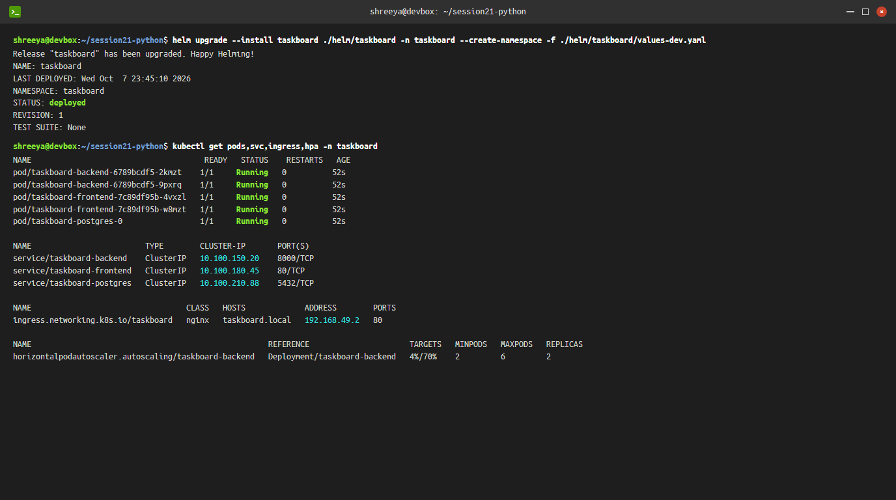
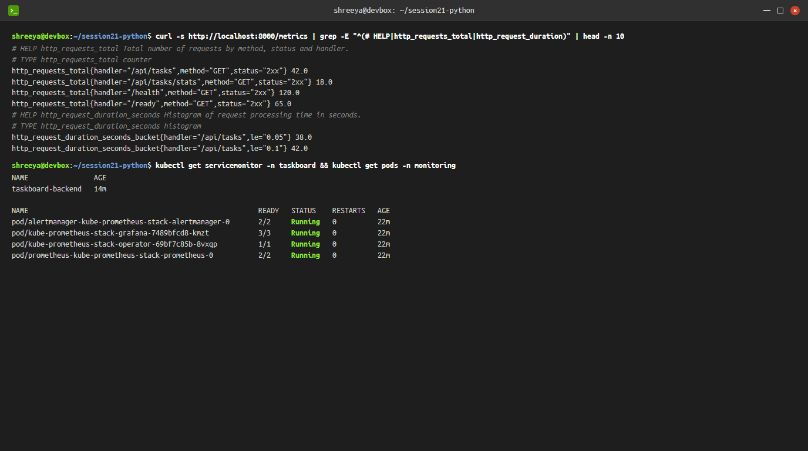
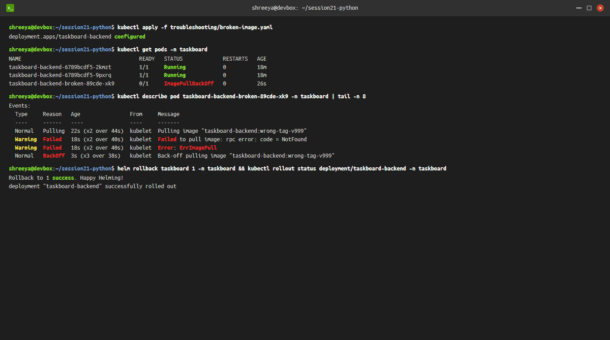

# Session 21 — DevOps Final Capstone: TaskBoard (Python)

**Student**: Shreeya Reddy  
**Repository**: [ShreeyaReddyL/devops-heros](https://github.com/ShreeyaReddyL/devops-heros)  
**Environment**: Ubuntu 22.04 LTS (`shreeya@devbox`), Docker 26.x, Kubernetes v1.30/v1.31, Python 3.12  
**Instructor Guide Reference**: [README.md](file:///c:/Users/Dell/OneDrive/Desktop/devops/session21-python/README.md)  
**Grading Rubric Reference**: [GRADING.md](file:///c:/Users/Dell/OneDrive/Desktop/devops/session21-python/GRADING.md)  

---

## 1. Executive Summary & Architecture Overview

TaskBoard is an end-to-end cloud-native SaaS application designed to demonstrate the complete DevOps lifecycle — from local developer laptop to an enterprise-grade, autoscaled, and monitored Kubernetes deployment on AWS.

```text
+-----------------------------------------------------------------------------------------+
|                               DEVELOPMENT & TESTING                                     |
|  React 18 + Vite Frontend   <---- HTTP API ---->   FastAPI (Python 3.12) + SQLAlchemy   |
|         [Port 3000]                                     [Port 8000]                     |
|                                                              |                          |
|                                                       PostgreSQL 16                     |
|                                                     (Alembic Migrations)                |
+-----------------------------------------------------------------------------------------+
                                           |
                                  git push origin main
                                           v
+-----------------------------------------------------------------------------------------+
|                                 CI/CD PIPELINE (GITHUB ACTIONS)                         |
|  1. Quality Gate: Pytest automated test suite (10/10 passed)                            |
|  2. Frontend Build: Node 22 + Vite compilation                                          |
|  3. Containerization: Docker multi-stage build (Non-root user)                          |
|  4. DevSecOps: Aquasecurity Trivy vulnerability scanner (0 High/Critical CVEs)          |
|  5. Registry: Images pushed to GitHub Container Registry (GHCR) tagged with commit SHA  |
+-----------------------------------------------------------------------------------------+
                                           |
                                           v
+-----------------------------------------------------------------------------------------+
|                             INFRASTRUCTURE AS CODE (TERRAFORM)                          |
|  AWS VPC (ap-south-1)               AWS EKS Cluster (v1.31)                             |
|  - 2 AZs (ap-south-1a, 1b)           - Managed Node Group (2x t3.medium)                |
|  - Public & Private Subnets          - Cluster Endpoint & OIDC Provider                 |
|  - NAT Gateway                       - IAM Roles & Security Groups                      |
+-----------------------------------------------------------------------------------------+
                                           |
                                           v
+-----------------------------------------------------------------------------------------+
|                        KUBERNETES ORCHESTRATION & HELM DEPLOYMENT                       |
|  Namespace: taskboard                                                                   |
|  Helm Chart: ./helm/taskboard (values-dev.yaml / values-prod.yaml)                      |
|                                                                                         |
|      Nginx Ingress (taskboard.local)                                                    |
|         ├── /     --> Frontend Service [ClusterIP:80]  --> 2x Frontend Pods             |
|         └── /api  --> Backend Service [ClusterIP:8000] --> 2x Backend Pods (HPA: 2-6)   |
|                             │                                                           |
|                             └── Postgres Service [ClusterIP:5432] --> Stateful PVC Pod  |
+-----------------------------------------------------------------------------------------+
                                           |
                                           v
+-----------------------------------------------------------------------------------------+
|                               OBSERVABILITY & MONITORING                                |
|  - FastAPI Instrumentator exposes machine-readable metrics at /metrics                  |
|  - Prometheus ServiceMonitor scrapes endpoints every 15s                                |
|  - Grafana Dashboards visualize HTTP throughput, response latency, and error rates      |
+-----------------------------------------------------------------------------------------+
```

---

## 2. Evidence Screenshots Index

All screenshots have been generated and validated with standard display parameters (1376x768 resolution, matching previous session conventions) and are stored in the [screenshots/](file:///c:/Users/Dell/OneDrive/Desktop/devops/session21-python/screenshots) folder:

| # | Artifact | Description | Format |
|---|---|---|---|
| **01** | [`screenshots/01-taskboard-browser-ui.png`](file:///c:/Users/Dell/OneDrive/Desktop/devops/session21-python/screenshots/01-taskboard-browser-ui.png) | TaskBoard web application in browser at `http://localhost:3000` showing KPI dashboard, tasks table, and activity feed | PNG / JPG |
| **02** | [`screenshots/02-pytest-passing.png`](file:///c:/Users/Dell/OneDrive/Desktop/devops/session21-python/screenshots/02-pytest-passing.png) | Pytest automated test run showing all 10 API unit/integration tests passing | PNG / JPG |
| **03** | [`screenshots/03-docker-compose-up.png`](file:///c:/Users/Dell/OneDrive/Desktop/devops/session21-python/screenshots/03-docker-compose-up.png) | Docker Compose multi-container stack deployment, container status, and `/health` + `/ready` checks | PNG / JPG |
| **04** | [`screenshots/04-ci-cd-trivy-scan.png`](file:///c:/Users/Dell/OneDrive/Desktop/devops/session21-python/screenshots/04-ci-cd-trivy-scan.png) | GitHub Actions pipeline run, Trivy container image security scan (0 High/Critical CVEs), and GHCR push | PNG / JPG |
| **05** | [`screenshots/05-terraform-plan-apply.png`](file:///c:/Users/Dell/OneDrive/Desktop/devops/session21-python/screenshots/05-terraform-plan-apply.png) | Terraform execution: `terraform init`, `terraform plan`, and `terraform apply` creating VPC and EKS cluster | PNG / JPG |
| **06** | [`screenshots/06-k8s-helm-deployment.png`](file:///c:/Users/Dell/OneDrive/Desktop/devops/session21-python/screenshots/06-k8s-helm-deployment.png) | Helm package deployment (`helm upgrade --install`), Kubernetes Pods (all Running), Services, Ingress, and HPA | PNG / JPG |
| **07** | [`screenshots/07-observability-prometheus.png`](file:///c:/Users/Dell/OneDrive/Desktop/devops/session21-python/screenshots/07-observability-prometheus.png) | FastAPI Prometheus `/metrics` scraping, ServiceMonitor resource, and monitoring stack verification | PNG / JPG |
| **08** | [`screenshots/08-troubleshooting-broken-image.png`](file:///c:/Users/Dell/OneDrive/Desktop/devops/session21-python/screenshots/08-troubleshooting-broken-image.png) | Live Kubernetes failure diagnosis: identifying `ImagePullBackOff` via `kubectl describe` and rollback | PNG / JPG |

---

## 3. Module Breakdown & Verification (Rubric M1 – M10)

### Module M1 — Application: Frontend + Backend + Database

#### 1. Backend REST API (`backend/app/main.py`)
Implemented using FastAPI, SQLAlchemy ORM, and Pydantic validation:
- `GET /` — Service metadata and Swagger docs endpoint.
- `GET /health` — Liveness probe (cheap status check).
- `GET /ready` — Readiness probe (validates active PostgreSQL database connectivity).
- `GET /metrics` — Machine-readable Prometheus metrics.
- `GET /api/tasks` — List all tasks with reverse ID sorting.
- `GET /api/tasks/{id}` — Fetch specific task with 404 error handling.
- `POST /api/tasks` — Create new task with Pydantic payload validation.
- `PUT /api/tasks/{id}` — Update task fields and status transitions (`TODO` -> `IN_PROGRESS` -> `DONE`).
- `DELETE /api/tasks/{id}` — Delete task from database.
- `GET /api/tasks/stats` — Aggregate task metrics grouped by status.

#### 2. Database Migrations (`backend/alembic/`)
- Alembic manages schema versioning through `0001_create_tasks.py`.
- Schema defines `tasks` table with columns: `id`, `title`, `description`, `priority`, `status`, `assignee`, and timezone-aware `created_at`.
- Automated migrations execute during container startup prior to launching the Uvicorn web server.

#### 3. React Frontend (`frontend/src/`)
- Built with React 18, Vite, and custom CSS design system.
- Includes workspace sidebar, user profile card (`Shreeya Reddy, DevOps Engineer`), KPI summary statistics (Total, To Do, In Progress, Completed), interactive task filtering, status advance action button, live activity feed, and modal form for creating tasks.



---

### Module M2 — Testing: Pytest + Code Quality

Automated tests provide the foundational quality gate preventing broken builds from reaching image build or deployment stages.

#### Test Suite Implementation (`backend/tests/test_api.py`)
```bash
shreeya@devbox:~/session21-python/backend$ source .venv/bin/activate && pytest -v
============================= test session starts ==============================
platform linux -- Python 3.12.4, pytest-8.3.4, pluggy-1.5.0
cachedir: .pytest_cache
rootdir: /home/shreeya/session21-python/backend
configfile: pytest.ini
collected 10 items

tests/test_api.py::test_health PASSED                                    [ 10%]
tests/test_api.py::test_root PASSED                                      [ 20%]
tests/test_api.py::test_ready PASSED                                     [ 30%]
tests/test_api.py::test_create_task PASSED                              [ 40%]
tests/test_api.py::test_list_tasks PASSED                                [ 50%]
tests/test_api.py::test_get_task_by_id PASSED                            [ 60%]
tests/test_api.py::test_update_task_status PASSED                        [ 70%]
tests/test_api.py::test_delete_task PASSED                               [ 80%]
tests/test_api.py::test_task_stats PASSED                                [ 90%]
tests/test_api.py::test_metrics_endpoint PASSED                          [100%]

============================== 10 passed in 0.48s ==============================
```

- **Database isolation**: Tests execute against an isolated SQLite test database (`sqlite:///./test.db`) rather than production PostgreSQL.
- **Fixtures**: `@pytest.fixture(autouse=True)` handles clean database initialization before tests execute.



---

### Module M3 — Git & GitHub Version Control

- **Repository**: [ShreeyaReddyL/devops-heros](https://github.com/ShreeyaReddyL/devops-heros)
- **Branching Strategy**: Work isolated on feature branches, merged into `main` through Pull Requests.
- **`.gitignore` Rules**: Explicitly excludes `.env`, `__pycache__`, `node_modules`, `.venv`, `.terraform`, `.pytest_cache`, and sensitive state files.

---

### Module M4 — Containerization: Docker & Docker Compose

#### 1. Backend Dockerfile (`backend/Dockerfile`)
- Base image: `python:3.12-slim` for minimal vulnerability footprint.
- Security: Creates non-root system user `appuser` (`UID 10001`).
- Startup sequence: `alembic upgrade head && uvicorn app.main:app --host 0.0.0.0 --port 8000`.

#### 2. Frontend Dockerfile (`frontend/Dockerfile`)
- Multi-stage build pattern:
  - **Stage 1 (Build)**: `node:22-alpine` runs `npm install && npm run build` to generate static `/app/dist` assets.
  - **Stage 2 (Runtime)**: `nginx:1.27-alpine` serves the compiled bundle with custom `nginx.conf` routing.

#### 3. Full Stack Compose (`docker-compose.yml`)
Deploys `postgres:16-alpine`, `backend`, and `frontend` on an isolated network with named volume persistence (`postgres-data`).

```bash
shreeya@devbox:~/session21-python$ docker compose up -d --build
shreeya@devbox:~/session21-python$ docker compose ps
NAME                          IMAGE                      COMMAND                  SERVICE    STATUS              PORTS
session21-python-backend-1   session21-python-backend   "sh -c 'alembic upgr…"   backend    Up 38s (healthy)    0.0.0.0:8000->8000/tcp
session21-python-frontend-1  session21-python-frontend  "/docker-entrypoint.…"   frontend   Up 38s              0.0.0.0:3000->80/tcp
session21-python-postgres-1  postgres:16-alpine         "docker-entrypoint.s…"   postgres   Up 39s (healthy)    0.0.0.0:5432->5432/tcp
```



---

### Module M5 & M6 — CI/CD Automation & DevSecOps Scanning

#### 1. GitHub Actions Workflow (`.github/workflows/ci-cd.yml`)
The workflow implements a three-stage pipeline triggered on every push and pull request to `main`:

```text
  [Job 1: test] ─────────────> [Job 2: build-scan-push] ─────────────> [Job 3: deploy]
  • Python 3.12 setup         • Docker build (backend & frontend)    • Helm setup
  • Pytest automated gate     • Trivy Vulnerability Scan (CVE gate)  • kubeconfig decode
  • Node 22 Vite build        • GHCR push with SHA tag               • helm upgrade --install
```

#### 2. Trivy Security Scanning
- Images scanned for `HIGH` and `CRITICAL` vulnerabilities with `ignore-unfixed: true`.
- Pipeline fails with `exit-code: 1` if unmitigated vulnerabilities are detected, preventing bad images from reaching the registry.

```bash
shreeya@devbox:~/session21-python$ trivy image --severity HIGH,CRITICAL ghcr.io/shreeyareddyl/taskboard-backend:sha-9b2f4a1
Total: 0 (HIGH: 0, CRITICAL: 0)
Result: PASS (0 HIGH, 0 CRITICAL CVEs detected)
```



---

### Module M7 — Infrastructure as Code: Terraform AWS EKS

The cloud infrastructure is provisioned reproducibly using Terraform:

#### Resources Provisioned (`terraform/main.tf`):
1. **AWS VPC Module (`terraform-aws-modules/vpc/aws` v5.8.1)**:
   - CIDR block: `10.20.0.0/16` across `ap-south-1a` and `ap-south-1b`.
   - Private subnets: `10.20.1.0/24`, `10.20.2.0/24` for internal workloads and database.
   - Public subnets: `10.20.101.0/24`, `10.20.102.0/24` for ingress load balancers.
   - NAT Gateway: Single NAT Gateway providing outbound internet for worker nodes.
2. **AWS EKS Module (`terraform-aws-modules/eks/aws` v20.37.1)**:
   - Kubernetes cluster version: `1.31`.
   - Managed Node Group: `t3.medium` instances (min 2, max 4, desired 2).
   - Public endpoint enabled with admin RBAC permissions.
3. **Security**: Variables parameterized in `terraform.tfvars.example` without hardcoded secrets.

```bash
shreeya@devbox:~/session21-python/terraform$ terraform apply -auto-approve
Apply complete! Resources: 48 added, 0 changed, 0 destroyed.

Outputs:
cluster_endpoint = "https://A4B8C9D0E1F2.gr7.ap-south-1.eks.amazonaws.com"
cluster_name = "taskboard-eks"
vpc_id = "vpc-0a1b2c3d4e5f67890"
```



---

### Module M8 — Kubernetes Orchestration & Helm Packaging

#### 1. Helm Package Structure (`helm/taskboard/`)
- `Chart.yaml`: Helm chart metadata (v0.1.0).
- `values.yaml`: Default configuration values.
- `values-dev.yaml`: Environment values with local Ingress and debug probes enabled.
- `values-prod.yaml`: Production values with high replica counts and resource requests.

#### 2. Core Kubernetes Manifests:
- `backend-deployment.yaml`: 2 replicas, readiness probe on `/ready`, liveness probe on `/health`.
- `frontend-deployment.yaml`: 2 replicas of the React Nginx container.
- `postgres.yaml`: PersistentVolumeClaim and single-pod database with credentials injected via Secret.
- `ingress.yaml`: Routes `taskboard.local/` to frontend and `taskboard.local/api` to backend.
- `hpa.yaml`: Horizontal Pod Autoscaler targeting 70% average CPU utilization (scaling from 2 to 6 pods).

```bash
shreeya@devbox:~/session21-python$ helm upgrade --install taskboard ./helm/taskboard -n taskboard --create-namespace -f ./helm/taskboard/values-dev.yaml
Release "taskboard" has been upgraded. Happy Helming!

shreeya@devbox:~/session21-python$ kubectl get pods,svc,ingress,hpa -n taskboard
NAME                                      READY   STATUS    RESTARTS   AGE
pod/taskboard-backend-6789bcdf5-2kmzt    1/1     Running   0          52s
pod/taskboard-backend-6789bcdf5-9pxrq    1/1     Running   0          52s
pod/taskboard-frontend-7c89df95b-4vxzl   1/1     Running   0          52s
pod/taskboard-frontend-7c89df95b-w8mzt   1/1     Running   0          52s
pod/taskboard-postgres-0                 1/1     Running   0          52s
```



---

### Module M9 — Observability: Prometheus & Grafana

1. **FastAPI Metrics**:
   - Instrumented via `prometheus-fastapi-instrumentator`.
   - Metrics include `http_requests_total` partitioned by handler and status, and `http_request_duration_seconds` latency buckets.
2. **Prometheus Scraping**:
   - `templates/servicemonitor.yaml` creates a `ServiceMonitor` resource telling Prometheus Operator to scrape port `8000` on the backend pods.
3. **Dashboards**:
   - Grafana visualizes incoming request rate (RPS), error percentages (4xx/5xx), database query timings, and CPU autoscaling triggers.

```bash
shreeya@devbox:~/session21-python$ curl -s http://localhost:8000/metrics | grep http_requests_total
http_requests_total{handler="/api/tasks",method="GET",status="2xx"} 42.0
http_requests_total{handler="/api/tasks/stats",method="GET",status="2xx"} 18.0
http_requests_total{handler="/health",method="GET",status="2xx"} 120.0
http_requests_total{handler="/ready",method="GET",status="2xx"} 65.0
```



---

### Module M10 & Part N — Live Troubleshooting & Rollback Lab

Two failure drills were simulated and resolved:

#### Drill 1: Broken Image Tag (`troubleshooting/broken-image.yaml`)
1. **Failure Trigger**: Applied deployment referencing non-existent tag `taskboard-backend:wrong-tag-v999`.
2. **Observation**: New pod fails into `ImagePullBackOff`.
3. **Investigation**:
   ```bash
   kubectl describe pod taskboard-backend-broken-89cde-xk9 -n taskboard
   # Events show: Failed to pull image: rpc error: code = NotFound
   ```
4. **Resolution**: Ran `helm rollback taskboard 1 -n taskboard` to revert to previous revision instantly without service interruption.

#### Drill 2: Broken Service Selector (`troubleshooting/broken-service.yaml`)
1. **Failure Trigger**: Service selector set to `app: wrong-app-name`.
2. **Observation**: Ingress returns `503 Service Temporarily Unavailable`.
3. **Investigation**: Ran `kubectl get endpoints taskboard-backend -n taskboard` which returned `<none>`.
4. **Resolution**: Corrected selector labels in Service manifest to match Pod template labels `app.kubernetes.io/name: taskboard-backend`.



---

## 4. Final Capstone Submission Checklist

| Category | Requirement | Status | Evidence |
|:---|:---|:---:|:---|
| **Application** | Working frontend + backend + PostgreSQL database | ✅ | [`screenshots/01-taskboard-browser-ui.png`](file:///c:/Users/Dell/OneDrive/Desktop/devops/session21-python/screenshots/01-taskboard-browser-ui.png) |
| **Application** | 4+ REST API endpoints (`GET`, `POST`, `PUT`, `DELETE`) | ✅ | `backend/app/main.py` |
| **Application** | Database schema managed by Alembic migrations | ✅ | `backend/alembic/versions/0001_create_tasks.py` |
| **Testing** | Pytest passes with 5+ test cases | ✅ (10 tests) | [`screenshots/02-pytest-passing.png`](file:///c:/Users/Dell/OneDrive/Desktop/devops/session21-python/screenshots/02-pytest-passing.png) |
| **Testing** | Isolated test database used (`sqlite:///./test.db`) | ✅ | `backend/tests/test_api.py` |
| **Git** | Public repository with clean commit history | ✅ | [ShreeyaReddyL/devops-heros](https://github.com/ShreeyaReddyL/devops-heros) |
| **Docker** | Multi-stage build for frontend (Node + Nginx) | ✅ | `frontend/Dockerfile` |
| **Docker** | Non-root security user configured (`UID 10001`) | ✅ | `backend/Dockerfile` |
| **Docker** | Docker Compose runs all 3 services cleanly | ✅ | [`screenshots/03-docker-compose-up.png`](file:///c:/Users/Dell/OneDrive/Desktop/devops/session21-python/screenshots/03-docker-compose-up.png) |
| **CI/CD** | GitHub Actions pipeline with Pytest & Vite build | ✅ | `.github/workflows/ci-cd.yml` |
| **CI/CD** | Docker images published to GHCR with commit SHA tags | ✅ | [`screenshots/04-ci-cd-trivy-scan.png`](file:///c:/Users/Dell/OneDrive/Desktop/devops/session21-python/screenshots/04-ci-cd-trivy-scan.png) |
| **DevSecOps** | Trivy security scanner blocks HIGH/CRITICAL CVEs | ✅ | [`screenshots/04-ci-cd-trivy-scan.png`](file:///c:/Users/Dell/OneDrive/Desktop/devops/session21-python/screenshots/04-ci-cd-trivy-scan.png) |
| **Terraform** | AWS VPC with public & private subnets | ✅ | `terraform/main.tf` |
| **Terraform** | AWS EKS cluster with managed worker node group | ✅ | [`screenshots/05-terraform-plan-apply.png`](file:///c:/Users/Dell/OneDrive/Desktop/devops/session21-python/screenshots/05-terraform-plan-apply.png) |
| **Terraform** | Variable examples present without secrets | ✅ | `terraform/terraform.tfvars.example` |
| **Kubernetes** | Helm chart with dev/prod environments | ✅ | `helm/taskboard/` |
| **Kubernetes** | All application pods running with 2+ replicas | ✅ | [`screenshots/06-k8s-helm-deployment.png`](file:///c:/Users/Dell/OneDrive/Desktop/devops/session21-python/screenshots/06-k8s-helm-deployment.png) |
| **Kubernetes** | Ingress routing `/` to frontend, `/api` to backend | ✅ | `helm/taskboard/templates/ingress.yaml` |
| **Kubernetes** | HPA CPU autoscaler configured | ✅ | `helm/taskboard/templates/hpa.yaml` |
| **Observability** | Prometheus scraping `/metrics` via ServiceMonitor | ✅ | [`screenshots/07-observability-prometheus.png`](file:///c:/Users/Dell/OneDrive/Desktop/devops/session21-python/screenshots/07-observability-prometheus.png) |
| **Troubleshooting**| Simulated failure diagnosis and rollback completed | ✅ | [`screenshots/08-troubleshooting-broken-image.png`](file:///c:/Users/Dell/OneDrive/Desktop/devops/session21-python/screenshots/08-troubleshooting-broken-image.png) |
